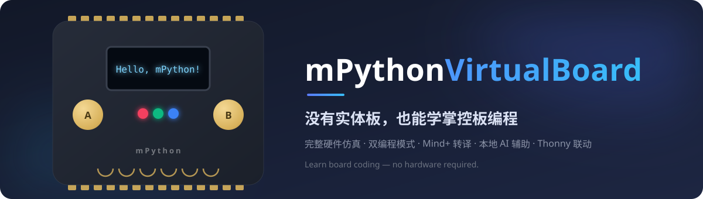

<div align="center">



**没有实体板，也能学掌控板编程**

[中文](README.md) · [English](README_EN.md)

[](LICENSE)
[](https://www.python.org/)
[](#)
[](https://github.com/lmxylyc/mPython-VirtualBoard/stargazers)

[🌐 在线体验交互宣传页](https://lmxylyc.github.io/mPython-VirtualBoard/) · [📖 详细使用文档](USER_GUIDE.md) · [🚀 快速上手指南](GettingStarted.md)

</div>

---

## 为什么需要它

器材不够、损耗心疼、课前发放课后回收——这些都不该成为编程课的阻碍。

- **零器材开课**：一人一台电脑即可拥有完整的掌控板体验，学校无需集中采购与维护硬件
- **代码所见即所得**：每一行代码都实时反映在虚拟板的屏幕、灯光与传感器上，调试直观
- **无缝衔接真实硬件**：同一套 mPython / PinPong API，课堂上在虚拟板验证，课后可直接烧录到实体板

## 核心功能

| | |
| --- | --- |
| 🖥️ **完整硬件仿真** | OLED 屏、三路 RGB、双按键、六路触摸、蜂鸣器，以及加速度、陀螺仪、磁力、光线、声音传感器 |
| 🔀 **双编程模式** | mPython 与 PinPong 两条教学路径自由切换，贴合不同教材与课程体系 |
| 🧩 **Mind+ 图形化转译** | 粘贴 Mind+ 上传模式自动生成的代码，内置转译器一键转为 Python 并直接运行 |
| 🤖 **本地 AI 辅助改写** | PinPong 模式接入本地 Ollama + DeepSeek 模型，自然语言要求改写成规范教学代码，数据不出本机 |
| 📈 **真实传感器接入** | USB 串口连接实体掌控板，实时读取真实加速度、陀螺仪、磁力、光线与声音数据 |
| 🪟 **Thonny 联动与悬浮窗** | 桌面版与 Thonny / IDLE 无缝配合，虚拟板窗口始终置顶悬浮，边写代码边看效果 |

## 两个版本，各取所需

| | **mPython VM Studio**（Web 工作台） | **mPython Virtual Machine**（桌面版） |
| --- | --- | --- |
| 定位 | 一体化教学工作台，打开即用 | Thonny / IDLE 课堂联动 |
| 技术栈 | PyWebView · Vue 3 · Monaco | Tkinter · Socket · 虚拟 USB |
| 亮点 | 内置编辑器、Mind+ 转译、AI 改写、真实传感器接入、传感器手动控制面板 | 一键启动、悬浮显示窗口、8 种界面语言、虚拟 USB 与客户端库 |
| 目录 | [`mpython-vm-web/`](mpython-vm-web/README.md) | 项目根目录 |

## 三分钟跑起来

**方式一：VM Studio 工作台（推荐）**

```bash
git clone https://github.com/lmxylyc/mPython-VirtualBoard.git
cd mPython-VirtualBoard/mpython-vm-web
pip install -r requirements.txt
python main.py
```

**方式二：桌面版虚拟机**

```bash
git clone https://github.com/lmxylyc/mPython-VirtualBoard.git
cd mPython-VirtualBoard
python start_vm.py        # 也可以双击 run.bat
```

**写一段代码试试（mPython 模式）：**

```python
from mpython_client import connect

mp = connect()

mp.oled.fill(0)
mp.oled.DispChar("Hello World!", 0, 0, 1)
mp.oled.show()

mp.rgb[0] = (255, 0, 0)
mp.rgb.write()
```

## 熟悉的硬件，熟悉的 API

虚拟板与实体掌控板保持一致的编程接口，学过的知识零成本迁移。

| 组件 | mPython API | PinPong API |
| --- | --- | --- |
| OLED 显示屏 | `mp.oled` | `get_oled()` |
| RGB LED ×3 | `mp.rgb` | `get_rgb()` |
| 按键 A / B | `mp.button_a` | `Pin(Pin.P0, Pin.IN)` |
| 触摸按键 ×6 | `mp.touch` | `Pin(Pin.P1, Pin.IN)` |
| 光线传感器 | `mp.light` | `Sensor(Pin.P2)` |
| 声音传感器 | `mp.sound` | `Sensor(Pin.P3)` |
| 加速度计 | `mp.accelerometer` | `get_accel()` |
| 陀螺仪 | `mp.gyroscope` | `get_gyro()` |
| 地磁传感器 | `mp.magnetic` | `get_mag()` |

## 为真实课堂而设计

- **图形化 → 代码过渡课**：学生先用 Mind+ 图形化编程，再观察转译后的 Python 代码，自然理解抽象概念
- **传感器认知课**：连接实体板或使用手动控制面板，直观理解加速度、光线、声音的数值变化
- **AI 代码改写课**：学生先写原始代码，再用本地 AI 改写为规范版本，对比中学习编程规范
- **无硬件演示课**：机房没有实体板时，虚拟板提供与真实硬件完全一致的教学体验

## 多语言界面

桌面版支持 8 种界面语言：中文 · English · 日本語 · 한국어 · Français · Deutsch · Español · Русский

## 文档与链接

- 🌐 [交互式宣传站（可在线玩虚拟板）](https://lmxylyc.github.io/mPython-VirtualBoard/)
- 📖 [详细使用文档（双模式完整指南）](USER_GUIDE.md)
- 🚀 [快速上手指南](GettingStarted.md)
- 💻 [Web 版专属文档](mpython-vm-web/README.md)

---

<div align="center">

**开发作者**：林奕呈 · **开源协议**：[MIT](LICENSE)

如果这个项目对你的课堂有帮助，欢迎点一颗 ⭐ **Star** 支持一下！

</div>
